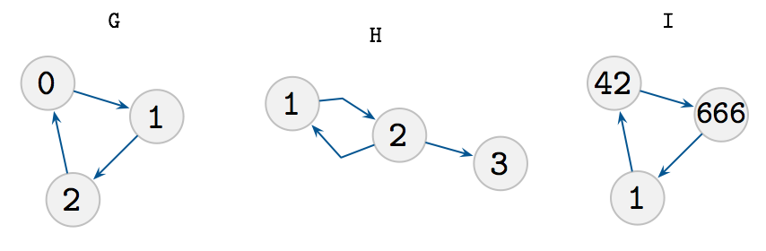
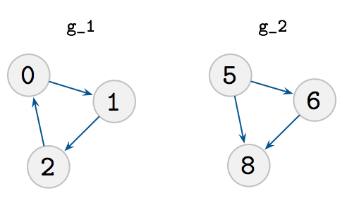
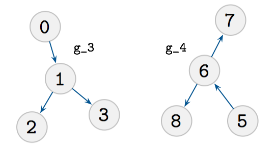

# Are two graphs isomorphic?

This is a small JS library that can check how many isomorphisms exists between two graphs.

```js
// npm install --save graph-isomorphisms
var computeIsomorphisms = require('graph-isomorphisms')
```
It is implement using *unification* (based on [datascript](https://github.com/tonsky/datascript)) and runtime is exponential in the number of **nodes**.
In other words, you can only check very small graphs.

### Examples



```js
var G = [ [1, 2], [2, 3], [3, 1] ]
// three isomorphims between G and itself
computeIsomorphisms(G, G).length === 3 //=> true

// G not isomorphic to H
var H = [ [1, 2], [2, 1], [1, 3] ]
computeIsomorphisms(G, H).length > 0 //=> false

// G is same graph as I, but with different node identifiers
var I = [ [42, 666], [666, 1], [1, 42] ]
computeIsomorphisms(G, I).length > 0 //=> true
```


### Note on runtime complexity.

*Graph Isomorphism* is a famous problem in computer science, on which some recent progress has been made by László Babai, giving an algorithm that runs in *"quasi-polynomial-time"*, e.g. efficient. We don't implement this algorithm, obviously.

https://www.quantamagazine.org/20151214-graph-isomorphism-algorithm/

## API

A graph is specified as an *edge list*, an array of pairs of numbers specifying a directed edge from the first to the second node.

For example, take these two graphs.



```js
var g_1 = [[0, 1], [1, 2], [2, 0]]
var g_2 = [[5, 6], [5, 8], [6, 8]]
```

You can now ask if these two are isomorphic (they shouldn't be).

```js
if (computeIsomorphisms(g_1, g_2).length === 0) {
  console.log('g_1 and g_2 are not isomorphic!')
}
```



Actually, if they are isomorphic, you will get proofs:
a mapping between the edges (negative numbers) and nodes.

```js
var g_3 = [[0, 1], [1, 2], [1, 3]]
var g_4 = [[6, 7], [5, 6], [6, 8]]
console.log(computeIsomorphisms(g_3, g_4))
// [
//   [ -1, -3, -0, -2, 3, 1, 2 ],
//   [ -1, -2, -0, -3, 2, 1, 3 ]
// ]
```

Notice the negative zero, LOL floating point numbers

That's it.
